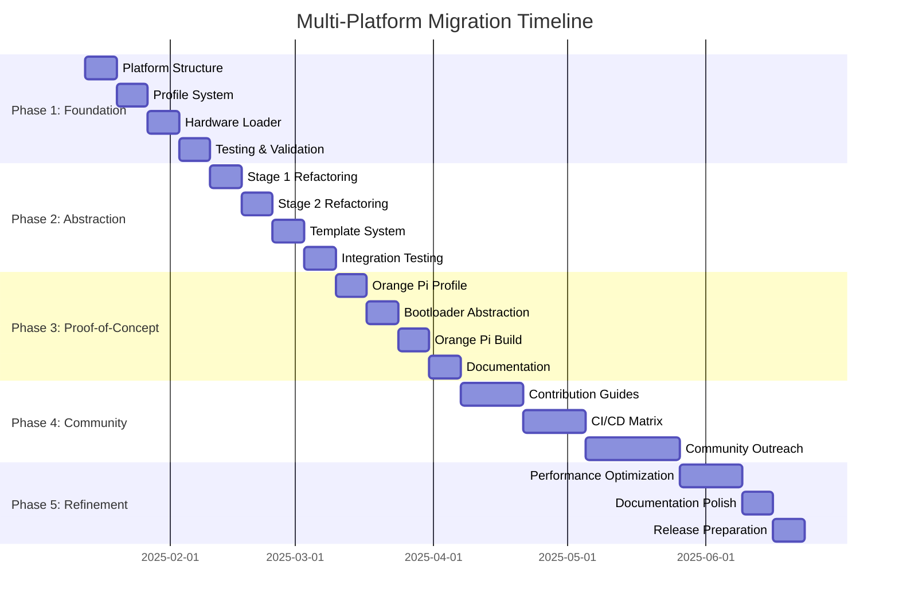

# Multi-Platform Migration Roadmap

## Overview

This document provides a detailed, phase-by-phase implementation plan for migrating `pimeleon-build` from a Raspberry Pi-specific build system to a multi-platform ARM router build system.

**Timeline**: 3-6 months (24 weeks)
**Approach**: Incremental refactoring with zero breaking changes
**Risk Level**: Low (extensive testing, backward compatibility)

## Implementation Phases



---

## Phase 1: Foundation (Weeks 1-4)

**Goal**: Create hardware abstraction infrastructure without breaking existing Pi builds.

**Success Criteria**:
- ✅ Platform directory structure exists
- ✅ Pi 3B+ profile created from hardcoded values
- ✅ Hardware loader parses YAML profiles
- ✅ Existing Pi builds work identically
- ✅ 100% test coverage maintained

### Week 1: Platform Directory Structure

#### Tasks

1. **Create directory structure** (2 hours)
   ```bash
   mkdir -p platforms/{core,raspberrypi,orangepi,community}/{profiles,hooks,tests,docs}
   mkdir -p platforms/core/scripts
   mkdir -p platforms/raspberrypi/templates
   ```

2. **Move common.sh to platforms/core** (1 hour)
   ```bash
   mv containers/builder/scripts/common.sh platforms/core/scripts/
   ln -s ../../../platforms/core/scripts/common.sh containers/builder/scripts/common.sh
   ```

3. **Create platform README files** (2 hours)
   - `platforms/README.md` - Overview
   - `platforms/core/README.md` - Core utilities documentation
   - `platforms/raspberrypi/README.md` - Pi-specific docs
   - `platforms/community/README.md` - Community contribution guide

4. **Update .gitignore** (30 minutes)
   ```
   # Platform-specific caches
   cache/*/

   # Platform test outputs
   platforms/*/tests/__pycache__/
   platforms/*/tests/.pytest_cache/
   ```

**Deliverables**:
- Directory structure created
- Documentation stubs in place
- Git history clean (using `git mv` for file moves)

---

### Week 2: Profile System

#### Tasks

1. **Define profile schema** (4 hours)
   - Document YAML schema in `docs/architecture/hardware-profiles.md` ✅ (already created)
   - Create JSON schema for validation: `platforms/core/profiles/schema.json`
   - Add example profiles in documentation

2. **Create Pi 3B+ profile** (4 hours)

   Extract all hardcoded values from current build scripts:

   ```bash
   # Scan for hardcoded values
   grep -r "bcm2710\|3B+\|buster\|raspbian\|mmcblk0" containers/builder/scripts/
   ```

   Create `platforms/raspberrypi/profiles/3b-plus.yaml`:
   ```yaml
   metadata:
     platform: raspberrypi
     model: 3B+
     display_name: "Raspberry Pi 3 Model B+"
     vendor: Raspberry Pi Foundation
     maintainer: core
     status: stable

   hardware:
     architecture: armhf
     soc: BCM2710
     storage_interface: sdcard

   bootloader:
     type: pi-firmware
     partition_type: vfat
     partition_size: 256M
     device_tree: bcm2710-rpi-3-b-plus.dtb
     config_template: platforms/raspberrypi/templates/config.txt.j2

   os:
     distribution: raspbian
     version: bullseye
     mirror: http://archive.raspbian.org/raspbian/
     architecture: armhf

   packages:
     kernel: raspberrypi-kernel
     firmware:
       - libraspberrypi-bin
       - firmware-brcm80211

   storage:
     device: mmcblk0
     root_partition_suffix: p2
     boot_partition_suffix: p1

   performance:
     arm_freq: 1200
     gpu_mem: 16
     over_voltage: 2

   features:
     uart: true
     spi: true
     i2c: true
     gpio: true
     hardware_groups:
       - gpio
       - i2c
       - spi
       - video
       - audio
   ```

3. **Create Pi 4B profile** (2 hours)
   - Copy 3B+ profile
   - Update for Pi 4 differences (BCM2711, different dtb, etc.)
   - Document changes in profile comments

4. **Create validation script** (4 hours)

   `scripts/validate-profile.sh`:
   ```bash
   #!/bin/bash
   set -euo pipefail

   PROFILE="$1"

   # Install yq if not available
   command -v yq >/dev/null || {
       echo "Installing yq..."
       wget -qO /usr/local/bin/yq https://github.com/mikefarah/yq/releases/latest/download/yq_linux_amd64
       chmod +x /usr/local/bin/yq
   }

   # Validate YAML syntax
   yq eval '.' "${PROFILE}" > /dev/null || {
       echo "❌ Invalid YAML syntax"
       exit 1
   }

   # Check required fields
   required_fields=(
       "metadata.platform"
       "metadata.model"
       "hardware.architecture"
       "bootloader.type"
       "os.distribution"
       "packages.kernel"
       "storage.device"
   )

   for field in "${required_fields[@]}"; do
       value=$(yq eval ".${field}" "${PROFILE}")
       if [[ "${value}" == "null" ]]; then
           echo "❌ Missing required field: ${field}"
           exit 1
       fi
   done

   echo "✅ Profile validation passed: ${PROFILE}"
   ```

**Deliverables**:
- Pi 3B+ and 4B profiles created
- Profile validation script
- Documentation updated

---

### Week 3: Hardware Loader

#### Tasks

1. **Create hardware-loader.sh** (8 hours)

   `scripts/hardware-loader.sh`:
   ```bash
   #!/bin/bash
   # Hardware profile loader

   set -euo pipefail

   # Ensure yq is available
   command -v yq >/dev/null || {
       die "yq is required but not installed. Install from https://github.com/mikefarah/yq"
   }

   # Load hardware profile into environment variables
   load_hardware_profile() {
       local profile="$1"

       log_info "Loading hardware profile: ${profile}"

       # Validate profile first
       validate_profile "${profile}"

       # Export all profile values with HW_ prefix
       export HW_PLATFORM=$(yq eval '.metadata.platform' "${profile}")
       export HW_MODEL=$(yq eval '.metadata.model' "${profile}")
       export HW_DISPLAY_NAME=$(yq eval '.metadata.display_name' "${profile}")
       export HW_MAINTAINER=$(yq eval '.metadata.maintainer' "${profile}")
       export HW_STATUS=$(yq eval '.metadata.status' "${profile}")

       export HW_ARCHITECTURE=$(yq eval '.hardware.architecture' "${profile}")
       export HW_SOC=$(yq eval '.hardware.soc' "${profile}")
       export HW_STORAGE_INTERFACE=$(yq eval '.hardware.storage_interface' "${profile}")

       export BOOT_TYPE=$(yq eval '.bootloader.type' "${profile}")
       export BOOT_PARTITION_TYPE=$(yq eval '.bootloader.partition_type' "${profile}")
       export BOOT_PARTITION_SIZE=$(yq eval '.bootloader.partition_size' "${profile}")
       export BOOT_DEVICE_TREE=$(yq eval '.bootloader.device_tree' "${profile}")
       export BOOT_CONFIG_TEMPLATE=$(yq eval '.bootloader.config_template' "${profile}")

       export OS_DISTRIBUTION=$(yq eval '.os.distribution' "${profile}")
       export OS_VERSION=$(yq eval '.os.version' "${profile}")
       export OS_MIRROR=$(yq eval '.os.mirror' "${profile}")
       export OS_ARCHITECTURE=$(yq eval '.os.architecture' "${profile}")

       export PACKAGES_KERNEL=$(yq eval '.packages.kernel' "${profile}")

       export STORAGE_DEVICE=$(yq eval '.storage.device' "${profile}")
       export STORAGE_ROOT_SUFFIX=$(yq eval '.storage.root_partition_suffix' "${profile}")
       export STORAGE_BOOT_SUFFIX=$(yq eval '.storage.boot_partition_suffix' "${profile}")

       # Arrays require special handling
       mapfile -t PACKAGES_FIRMWARE < <(yq eval '.packages.firmware[]' "${profile}")
       export PACKAGES_FIRMWARE

       mapfile -t HARDWARE_GROUPS < <(yq eval '.features.hardware_groups[]' "${profile}")
       export HARDWARE_GROUPS

       # Performance parameters (Pi-specific, may be null for other platforms)
       export PERF_ARM_FREQ=$(yq eval '.performance.arm_freq // ""' "${profile}")
       export PERF_GPU_MEM=$(yq eval '.performance.gpu_mem // ""' "${profile}")
       export PERF_OVER_VOLTAGE=$(yq eval '.performance.over_voltage // ""' "${profile}")

       # Feature flags
       export FEATURES_UART=$(yq eval '.features.uart // false' "${profile}")
       export FEATURES_SPI=$(yq eval '.features.spi // false' "${profile}")
       export FEATURES_I2C=$(yq eval '.features.i2c // false' "${profile}")
       export FEATURES_GPIO=$(yq eval '.features.gpio // false' "${profile}")

       log_info "Loaded profile for ${HW_DISPLAY_NAME} (${HW_PLATFORM}/${HW_MODEL})"
   }

   # Validate hardware profile
   validate_profile() {
       local profile="$1"

       [[ -f "${profile}" ]] || die "Profile not found: ${profile}"

       # Run validation script
       "${SCRIPT_DIR}/validate-profile.sh" "${profile}" || die "Profile validation failed"
   }

   # Generate platform-specific cache key
   generate_cache_key() {
       local base_name="$1"
       local version="$2"

       echo "${HW_PLATFORM}-${HW_MODEL}-${OS_VERSION}-${OS_ARCHITECTURE}-${base_name}-v${version}.tar.gz"
   }
   ```

2. **Update environment variables** (2 hours)

   Add to `.env.example`:
   ```bash
   # Hardware Platform Configuration
   PIMELEON_PLATFORM=raspberrypi   # Platform: raspberrypi, orangepi, rockpi
   PIMELEON_MODEL=3B+              # Model within platform

   # Backward compatibility (deprecated, use PIMELEON_MODEL instead)
   # PIMELEON_RPI_MODEL=3B+
   ```

3. **Add backward compatibility layer** (4 hours)

   In `containers/builder/scripts/build.sh`:
   ```bash
   # Backward compatibility for old variable names
   if [[ -n "${PIMELEON_RPI_MODEL:-}" ]]; then
       log_warn "PIMELEON_RPI_MODEL is deprecated, use PIMELEON_PLATFORM and PIMELEON_MODEL"
       PIMELEON_PLATFORM="raspberrypi"
       PIMELEON_MODEL="${PIMELEON_RPI_MODEL}"
   fi

   # Set defaults
   PIMELEON_PLATFORM="${PIMELEON_PLATFORM:-raspberrypi}"
   PIMELEON_MODEL="${PIMELEON_MODEL:-3B+}"

   # Load hardware profile
   PROFILE_PATH="${WORKSPACE}/platforms/${PIMELEON_PLATFORM}/profiles/${PIMELEON_MODEL}.yaml"
   source /scripts/hardware-loader.sh
   load_hardware_profile "${PROFILE_PATH}"
   ```

4. **Add yq to Docker container** (1 hour)

   In `containers/builder/Dockerfile`:
   ```dockerfile
   # Install yq for YAML parsing
   RUN wget -qO /usr/local/bin/yq \
       https://github.com/mikefarah/yq/releases/latest/download/yq_linux_amd64 && \
       chmod +x /usr/local/bin/yq
   ```

**Deliverables**:
- Hardware loader script functional
- Environment variables updated
- Backward compatibility verified
- Docker image includes yq

---

### Week 4: Testing & Validation

#### Tasks

1. **Create test suite for profiles** (6 hours)

   `platforms/core/tests/test_profiles.py`:
   ```python
   import pytest
   import yaml
   from pathlib import Path

   def test_all_profiles_valid():
       """Test that all platform profiles are valid YAML"""
       profiles = Path("platforms").rglob("*.yaml")

       for profile in profiles:
           with open(profile) as f:
               data = yaml.safe_load(f)
               assert data is not None, f"Invalid YAML: {profile}"

   def test_required_fields():
       """Test that all profiles have required fields"""
       required = [
           "metadata.platform",
           "metadata.model",
           "hardware.architecture",
           "bootloader.type",
           "os.distribution",
           "packages.kernel",
           "storage.device"
       ]

       profiles = Path("platforms").rglob("*.yaml")
       for profile in profiles:
           with open(profile) as f:
               data = yaml.safe_load(f)

               for field in required:
                   parts = field.split('.')
                   value = data
                   for part in parts:
                       assert part in value, f"Missing {field} in {profile}"
                       value = value[part]
   ```

2. **Test backward compatibility** (4 hours)
   - Build with `PIMELEON_RPI_MODEL=3B+` (old variable)
   - Build with `PIMELEON_PLATFORM=raspberrypi PIMELEON_MODEL=3B+` (new variables)
   - Compare output images (should be identical)
   - Document results

3. **Regression testing** (4 hours)
   - Run full test suite with profile-based builds
   - Compare with baseline (commit before profile changes)
   - Ensure boot time, image size, functionality identical
   - Update test expectations if needed

4. **Documentation updates** (2 hours)
   - Update README with profile system
   - Update environment variables reference
   - Add migration guide for existing users
   - Update CI/CD documentation

**Deliverables**:
- Automated profile validation tests
- Backward compatibility verified
- Regression tests pass
- Documentation updated

---

## Phase 2: Abstraction (Weeks 5-8)

**Goal**: Refactor build stages to use profiles instead of hardcoded values.

**Success Criteria**:
- ✅ All hardcoded Pi values replaced with profile variables
- ✅ Multiple Pi models build from profiles
- ✅ Boot configuration templating system works
- ✅ Zero breaking changes

### Week 5: Stage 1 Refactoring

#### Tasks

1. **Refactor cache key generation** (3 hours)

   **Before** (`stage1-base.sh:21-22`):
   ```bash
   RPI_CACHE_NAME=$(echo "${PIMELEON_RPI_MODEL}" | sed -E 's/^([0-9]+).*/rpi\1/')
   RASPBIAN_CACHE_KEY="pimeleon-${RPI_CACHE_NAME}-${RASPBIAN_VERSION}-base-${CACHE_VERSION}.tar.gz"
   ```

   **After**:
   ```bash
   # Use platform-specific cache key from profile
   CACHE_KEY=$(generate_cache_key "base" "${CACHE_VERSION}")
   # Example output: raspberrypi-3B+-bullseye-armhf-base-v1.tar.gz
   ```

2. **Refactor debootstrap calls** (3 hours)

   **Before**:
   ```bash
   debootstrap --arch=armhf bullseye "${MOUNT_POINT}" http://archive.raspbian.org/raspbian/
   ```

   **After**:
   ```bash
   debootstrap --arch="${OS_ARCHITECTURE}" "${OS_VERSION}" "${MOUNT_POINT}" "${OS_MIRROR}"
   ```

3. **Refactor partition configuration** (4 hours)

   **Before**:
   ```bash
   # Hardcoded partition sizes
   BOOT_SIZE=256M
   ```

   **After**:
   ```bash
   # From profile
   BOOT_SIZE="${BOOT_PARTITION_SIZE}"
   BOOT_FS="${BOOT_PARTITION_TYPE}"
   ```

4. **Test stage 1 changes** (4 hours)
   - Build Pi 3B+ and 4B from profiles
   - Verify cache generation
   - Confirm partition layout
   - Check debootstrap success

**Deliverables**:
- Stage 1 fully profile-driven
- Multiple Pi models build successfully
- Cache keys platform-specific

---

### Week 6: Stage 2 Refactoring

#### Tasks

1. **Refactor device tree handling** (4 hours)

   **Before** (`stage2-customize.sh:74`):
   ```bash
   sudo cp "${MOUNT_POINT}/boot/bcm2710-rpi-3-b-plus.dtb" "${BOOT_MOUNT}/"
   ```

   **After**:
   ```bash
   # Copy device tree if specified in profile
   if [[ -n "${BOOT_DEVICE_TREE}" && "${BOOT_DEVICE_TREE}" != "null" ]]; then
       if [[ -f "${MOUNT_POINT}/boot/${BOOT_DEVICE_TREE}" ]]; then
           sudo cp "${MOUNT_POINT}/boot/${BOOT_DEVICE_TREE}" "${BOOT_MOUNT}/"
           log_info "Copied device tree: ${BOOT_DEVICE_TREE}"
       else
           log_warn "Device tree not found: ${BOOT_DEVICE_TREE} (may be embedded in kernel)"
       fi
   fi
   ```

2. **Refactor package installation** (4 hours)

   **Before**:
   ```bash
   chroot_run apt-get install -y raspberrypi-kernel libraspberrypi-bin firmware-brcm80211
   ```

   **After**:
   ```bash
   # Install kernel from profile
   log_info "Installing kernel: ${PACKAGES_KERNEL}"
   chroot_run apt-get install -y "${PACKAGES_KERNEL}"

   # Install firmware packages from profile
   if [[ ${#PACKAGES_FIRMWARE[@]} -gt 0 ]]; then
       log_info "Installing firmware packages: ${PACKAGES_FIRMWARE[*]}"
       for pkg in "${PACKAGES_FIRMWARE[@]}"; do
           chroot_run apt-get install -y "${pkg}" || log_warn "Failed to install: ${pkg}"
       done
   fi
   ```

3. **Refactor hardware groups creation** (3 hours)

   **Before**:
   ```bash
   for group in gpio i2c spi video audio; do
       chroot_run groupadd -f "${group}"
   done
   ```

   **After**:
   ```bash
   # Create hardware-specific groups from profile
   if [[ ${#HARDWARE_GROUPS[@]} -gt 0 ]]; then
       log_info "Creating hardware groups: ${HARDWARE_GROUPS[*]}"
       for group in "${HARDWARE_GROUPS[@]}"; do
           chroot_run groupadd -f "${group}"
           chroot_run usermod -aG "${group}" pi
       done
   fi
   ```

4. **Refactor fstab generation** (3 hours)

   **Before**:
   ```bash
   /dev/mmcblk0p2  /       ext4    defaults,noatime  0       1
   /dev/mmcblk0p1  /boot   vfat    defaults          0       2
   ```

   **After**:
   ```bash
   /dev/${STORAGE_DEVICE}${STORAGE_ROOT_SUFFIX}  /       ${STORAGE_ROOT_FS}    defaults,noatime  0       1
   /dev/${STORAGE_DEVICE}${STORAGE_BOOT_SUFFIX}  /boot   ${STORAGE_BOOT_FS}    defaults          0       2
   ```

**Deliverables**:
- Stage 2 fully profile-driven
- Hardware-specific logic conditional
- Multiple models build successfully

---

### Week 7: Template System

#### Tasks

1. **Create Jinja2 template renderer** (6 hours)

   `scripts/render-template.py`:
   ```python
   #!/usr/bin/env python3
   import os
   import sys
   from jinja2 import Template

   def render_template(template_path, output_path=None):
       # Load template
       with open(template_path) as f:
           template = Template(f.read())

       # Get environment variables (HW_*, BOOT_*, etc.)
       context = {k: v for k, v in os.environ.items()
                  if k.startswith(('HW_', 'BOOT_', 'OS_', 'PERF_', 'FEATURES_'))}

       # Render template
       rendered = template.render(**context)

       # Output
       if output_path:
           with open(output_path, 'w') as f:
               f.write(rendered)
       else:
           print(rendered)

   if __name__ == '__main__':
       render_template(sys.argv[1], sys.argv[2] if len(sys.argv) > 2 else None)
   ```

2. **Create Pi config.txt template** (3 hours)

   `platforms/raspberrypi/templates/config.txt.j2`:
   ```jinja2
   # Raspberry Pi {{ HW_MODEL }} Boot Configuration
   # Generated by pimeleon-build

   # UART Configuration
   enable_uart={{ 1 if FEATURES_UART == 'true' else 0 }}

   # Hardware Interfaces
   dtparam=spi={{ 'on' if FEATURES_SPI == 'true' else 'off' }}
   dtparam=i2c_arm={{ 'on' if FEATURES_I2C == 'true' else 'off' }}

   # Performance Tuning
   
   arm_freq={{ PERF_ARM_FREQ }}
   
   
   gpu_mem={{ PERF_GPU_MEM }}
   
   
   over_voltage={{ PERF_OVER_VOLTAGE }}
   

   # Device Tree
   dtoverlay=vc4-kms-v3d

   # Additional configuration can be added here
   ```

3. **Integrate template rendering in stage1** (4 hours)

   **Before** (`stage1-base.sh:168-182`):
   ```bash
   cat > "${BOOT_MOUNT}/config.txt" << EOF
   enable_uart=1
   dtparam=spi=on
   dtparam=i2c_arm=on
   gpu_mem=16
   arm_freq=1200
   over_voltage=2
   EOF
   ```

   **After**:
   ```bash
   # Render boot configuration from template
   if [[ -n "${BOOT_CONFIG_TEMPLATE}" && "${BOOT_CONFIG_TEMPLATE}" != "null" ]]; then
       log_info "Rendering boot config from template: ${BOOT_CONFIG_TEMPLATE}"
       python3 /scripts/render-template.py \
           "${WORKSPACE}/${BOOT_CONFIG_TEMPLATE}" \
           "${BOOT_MOUNT}/config.txt"
   else
       log_warn "No boot config template specified for platform ${HW_PLATFORM}"
   fi
   ```

4. **Add Jinja2 to container** (1 hour)

   In `containers/builder/Dockerfile`:
   ```dockerfile
   # Install Python and Jinja2 for template rendering
   RUN apt-get update && apt-get install -y \
       python3 \
       python3-pip && \
       pip3 install jinja2
   ```

**Deliverables**:
- Template rendering system functional
- Pi config.txt generated from template
- Multiple models use correct config

---

### Week 8: Integration Testing

#### Tasks

1. **Build all Pi models from profiles** (4 hours)
   - Pi 3B+ (primary)
   - Pi 4B
   - Pi Zero W (if profile created)
   - Compare outputs

2. **Boot testing** (4 hours)
   - QEMU boot test for each model
   - Verify boot configuration applied
   - Check hardware groups created
   - Confirm package installation

3. **Performance benchmarking** (4 hours)
   - Build time comparison (before vs after)
   - Image size comparison
   - Cache hit rates
   - Document any regressions

4. **Update documentation** (4 hours)
   - Document profile system usage
   - Add examples for multiple models
   - Update troubleshooting guide
   - Create migration FAQ

**Deliverables**:
- All Pi models build successfully
- Boot tests pass
- Performance maintained
- Documentation complete

---

## Phase 3: Proof-of-Concept (Weeks 9-12)

**Goal**: Validate abstraction with non-Pi hardware (Orange Pi 5 Plus).

**Success Criteria**:
- ✅ Orange Pi 5+ profile created
- ✅ U-Boot bootloader support added
- ✅ Orange Pi image builds successfully
- ✅ Orange Pi boots in QEMU or real hardware

### Week 9: Orange Pi Profile

#### Tasks

1. **Research Orange Pi 5+ requirements** (4 hours)
   - Rockchip RK3588 specifications
   - Armbian vs mainline Debian
   - U-Boot requirements
   - Device tree sources

2. **Create Orange Pi 5+ profile** (6 hours)

   `platforms/orangepi/profiles/5-plus.yaml`:
   ```yaml
   metadata:
     platform: orangepi
     model: 5-plus
     display_name: "Orange Pi 5 Plus"
     vendor: Shenzhen Xunlong Software
     maintainer: core
     status: beta

   hardware:
     architecture: arm64
     soc: RK3588
     cpu_cores: 8
     ram_mb: 16384
     storage_interface: emmc

   bootloader:
     type: u-boot
     partition_type: ext4
     partition_size: 512M
     device_tree: rk3588-orangepi-5-plus.dtb
     config_template: platforms/orangepi/templates/boot.scr.j2

   os:
     distribution: debian
     version: bookworm
     mirror: http://deb.debian.org/debian/
     architecture: arm64

   packages:
     kernel: linux-image-arm64
     firmware:
       - firmware-realtek

   storage:
     device: mmcblk1
     root_partition_suffix: p2
     boot_partition_suffix: p1

   features:
     uart: true
     gpio: true
   ```

3. **Test profile validation** (2 hours)
   ```bash
   ./scripts/validate-profile.sh platforms/orangepi/profiles/5-plus.yaml
   ```

4. **Document Orange Pi specifics** (2 hours)
   - Create `platforms/orangepi/README.md`
   - Document hardware differences vs Pi
   - List known limitations

**Deliverables**:
- Orange Pi 5+ profile created
- Profile validates successfully
- Documentation written

---

### Week 10: Bootloader Abstraction

#### Tasks

1. **Add U-Boot support to stage1** (6 hours)

   ```bash
   # In stage1-base.sh

   case "${BOOT_TYPE}" in
       pi-firmware)
           # Download Pi firmware (existing code)
           ;;
       u-boot)
           # Download U-Boot for platform
           log_info "Installing U-Boot for ${HW_PLATFORM}"
           # Platform-specific U-Boot installation
           if [[ -f "platforms/${HW_PLATFORM}/hooks/install-uboot.sh" ]]; then
               source "platforms/${HW_PLATFORM}/hooks/install-uboot.sh"
               install_uboot "${BOOT_MOUNT}"
           fi
           ;;
       *)
           die "Unsupported bootloader type: ${BOOT_TYPE}"
           ;;
   esac
   ```

2. **Create U-Boot hook for Orange Pi** (6 hours)

   `platforms/orangepi/hooks/install-uboot.sh`:
   ```bash
   #!/bin/bash

   install_uboot() {
       local boot_mount="$1"

       log_info "Installing U-Boot for Orange Pi 5+"

       # Download pre-built U-Boot (or build from source)
       wget -O /tmp/u-boot-orangepi5plus.deb \
           https://github.com/orangepi-xunlong/orangepi-build/releases/download/v5.10/u-boot-orangepi5plus_2023.04_arm64.deb

       # Install U-Boot to image
       dpkg -x /tmp/u-boot-orangepi5plus.deb /tmp/uboot
       cp /tmp/uboot/usr/lib/u-boot/* "${boot_mount}/"

       log_info "U-Boot installed successfully"
   }
   ```

3. **Create boot script template** (4 hours)

   `platforms/orangepi/templates/boot.scr.j2`:
   ```bash
   # Orange Pi {{ HW_MODEL }} U-Boot Boot Script

   # Set boot arguments
   setenv bootargs "console=ttyS2,1500000 root=/dev/{{ STORAGE_DEVICE }}{{ STORAGE_ROOT_SUFFIX }} rootfstype=ext4 rootwait"

   # Load kernel and device tree
   load mmc 1:1 ${kernel_addr_r} /vmlinuz
   load mmc 1:1 ${fdt_addr_r} /dtb/rockchip/{{ BOOT_DEVICE_TREE }}
   load mmc 1:1 ${ramdisk_addr_r} /initrd.img

   # Boot
   booti ${kernel_addr_r} ${ramdisk_addr_r}:${filesize} ${fdt_addr_r}
   ```

4. **Add mkimage to container** (2 hours)

   In `containers/builder/Dockerfile`:
   ```dockerfile
   # Install U-Boot tools for boot script compilation
   RUN apt-get install -y u-boot-tools
   ```

**Deliverables**:
- U-Boot support implemented
- Orange Pi hook created
- Boot script template ready

---

### Week 11: Orange Pi Build

#### Tasks

1. **First build attempt** (4 hours)
   ```bash
   PIMELEON_PLATFORM=orangepi PIMELEON_MODEL=5-plus make build
   ```
   - Document errors
   - Identify missing dependencies
   - Fix issues iteratively

2. **Debug and fix issues** (8 hours)
   - ARM64 cross-compilation issues
   - Package availability in Debian repos
   - Device tree compilation
   - Boot script generation

3. **Optimize Orange Pi build** (4 hours)
   - Add platform-specific caching
   - Tune build parameters
   - Reduce build time

**Deliverables**:
- Orange Pi 5+ builds successfully
- Build time <20 minutes
- Image file generated

---

### Week 12: Documentation & Testing

#### Tasks

1. **Create Orange Pi documentation** (4 hours)
   - `docs/platforms/orangepi.md`
   - Quick start guide
   - Hardware comparison vs Pi
   - Known issues and limitations

2. **QEMU testing** (4 hours)
   - Boot Orange Pi image in QEMU
   - Verify kernel loads
   - Check device tree application
   - Document boot process

3. **Update platform comparison** (2 hours)
   - Create `docs/platforms/index.md`
   - Comparison table (Pi vs Orange Pi)
   - Feature matrix
   - Performance benchmarks

4. **Community announcement** (2 hours)
   - Update README with Orange Pi support
   - Add "Multi-Platform" badge
   - Soft announcement (no press release)

**Deliverables**:
- Orange Pi documented
- QEMU tests pass
- Platform comparison published
- Community informed

---

## Phase 4: Community Enablement (Weeks 13-20)

**Goal**: Enable community contributions of new platforms.

**Success Criteria**:
- ✅ Contribution guidelines published
- ✅ CI/CD supports platform matrix
- ✅ 1+ community platform submitted
- ✅ Platform maintainer role established

### Weeks 13-14: Contribution Guidelines

#### Tasks

1. **Create comprehensive contribution guide** (8 hours)
   - See `docs/contributing/adding-platforms.md` (to be created next)
   - Platform profile requirements
   - Testing requirements
   - PR process
   - Maintainer expectations

2. **Create platform template** (4 hours)

   `platforms/.template/`:
   ```
   profiles/
   ├── model.yaml.example
   └── README.md
   hooks/
   └── README.md
   tests/
   └── README.md
   README.md
   ```

3. **Document platform hooks** (4 hours)
   - Pre-customize hook
   - Post-customize hook
   - Install-bootloader hook
   - Examples for each

4. **Create platform checklist** (2 hours)
   - PR template for new platforms
   - Required tests
   - Documentation requirements
   - Maintainer commitment

**Deliverables**:
- Contribution guide complete
- Platform template available
- Hooks documented
- PR template created

---

### Weeks 15-16: CI/CD Platform Matrix

#### Tasks

1. **Update GitLab CI pipeline** (8 hours)

   `.gitlab-ci.yml`:
   ```yaml
   build:multi-platform:
     stage: build
     parallel:
       matrix:
         - PLATFORM: raspberrypi
           MODEL: [3B+, 4B]
         - PLATFORM: orangepi
           MODEL: [5-plus]
     script:
       - export PIMELEON_PLATFORM=${PLATFORM}
       - export PIMELEON_MODEL=${MODEL}
       - docker compose run --rm builder
     artifacts:
       paths:
         - output/pimeleon-*.img
       expire_in: 7 days
   ```

2. **Add platform-specific tests** (6 hours)
   - Per-platform test suites
   - Boot validation per platform
   - Hardware feature tests
   - Automated test runs in CI

3. **Optimize CI performance** (4 hours)
   - Parallel builds
   - Cache sharing between platforms
   - Selective testing (only changed platforms)
   - Build time limits

4. **Add platform status badges** (2 hours)
   - Build status per platform
   - Test status per platform
   - Update README with badges

**Deliverables**:
- CI/CD matrix functional
- Platform tests automated
- Build badges displayed

---

### Weeks 17-20: Community Outreach

#### Tasks

1. **Platform maintainer recruitment** (Ongoing)
   - Create "Platform Maintainer Wanted" issues
   - Reach out to community members
   - Document maintainer benefits
   - Establish communication channels

2. **Community platform submissions** (Ongoing)
   - Review incoming platform PRs
   - Provide feedback and guidance
   - Merge approved platforms
   - Recognize contributors

3. **Platform showcase** (4 hours)
   - Create community platform gallery
   - Showcase contributed platforms
   - Highlight maintainers
   - Success stories

4. **Community documentation** (4 hours)
   - FAQ for platform contributors
   - Troubleshooting common issues
   - Best practices guide
   - Video tutorial (optional)

**Deliverables**:
- 1+ community platform accepted
- Platform maintainer role filled
- Community gallery published
- Contributors recognized

---

## Phase 5: Refinement (Weeks 21-24)

**Goal**: Polish, optimize, and prepare for stable release.

**Success Criteria**:
- ✅ Performance optimized
- ✅ Documentation complete
- ✅ Release prepared
- ✅ Community active

### Weeks 21-22: Performance Optimization

#### Tasks

1. **Build time optimization** (8 hours)
   - Profile-specific caching improvements
   - Parallel debootstrap
   - Layer cache optimization
   - Benchmark improvements

2. **Storage optimization** (4 hours)
   - Cache cleanup strategies
   - Image compression tuning
   - Output directory management
   - Cloud storage for large caches

3. **CI/CD optimization** (4 hours)
   - Pipeline parallelization
   - Selective platform builds
   - Artifact management
   - Cost reduction

4. **Memory and CPU tuning** (4 hours)
   - Container resource limits
   - Build concurrency tuning
   - QEMU optimization
   - Build server sizing

**Deliverables**:
- Build times <15 min (all platforms)
- CI/CD pipeline <30 min
- Cache hit rates >90%
- Resource usage optimized

---

### Week 23: Documentation Polish

#### Tasks

1. **Documentation review and updates** (8 hours)
   - Review all docs for accuracy
   - Update screenshots
   - Fix broken links
   - Improve examples

2. **Create video tutorials** (6 hours)
   - Quick start for Pi
   - Adding a new platform
   - Contributing guide walkthrough
   - Troubleshooting common issues

3. **Improve discoverability** (4 hours)
   - SEO optimization
   - Better navigation
   - Search functionality
   - Cross-references

4. **Multi-language support** (Optional, 4 hours)
   - Translate key docs
   - Community translations
   - Language selector

**Deliverables**:
- Documentation 100% accurate
- Video tutorials published
- SEO improved
- Navigation enhanced

---

### Week 24: Release Preparation

#### Tasks

1. **Final testing** (6 hours)
   - Full test suite all platforms
   - Smoke tests
   - Integration tests
   - Security scan

2. **Release notes** (4 hours)
   - Changelog
   - Migration guide
   - Breaking changes (if any)
   - Upgrade instructions

3. **Version tagging** (2 hours)
   - Semantic versioning
   - Git tags
   - Release branches
   - Artifact publishing

4. **Announcement** (4 hours)
   - Blog post
   - Social media
   - Community forums
   - Press release (optional)

**Deliverables**:
- v2.0.0 released
- Release notes published
- Community announced
- Press coverage (optional)

---

## Risk Management

### Technical Risks

| Risk | Mitigation | Contingency |
|------|------------|-------------|
| Profile complexity | Keep schema simple, good defaults | Provide comprehensive examples |
| Breaking changes | Extensive testing, backward compat | Maintain v1 branch for 6 months |
| Build failures | Require tests before merge | Platform maintainers fix issues |
| Performance regression | Continuous benchmarking | Optimize or rollback changes |

### Schedule Risks

| Risk | Mitigation | Contingency |
|------|------------|-------------|
| Underestimated effort | 20% time buffer per phase | Extend timeline or reduce scope |
| Blocked dependencies | Parallel workstreams | Re-sequence tasks |
| Resource constraints | Prioritize critical path | Community contributions |

### Community Risks

| Risk | Mitigation | Contingency |
|------|------------|-------------|
| Low contribution rate | Active recruitment, good docs | Core team maintains more platforms |
| Low-quality submissions | Strict review process | Provide detailed feedback |
| Maintainer burnout | Clear expectations, shared load | Backup maintainers |

---

## Success Metrics Tracking

### Weekly Metrics

| Metric | Target | Measurement |
|--------|--------|-------------|
| Build success rate | >95% | CI/CD pipeline |
| Test coverage | >90% | pytest coverage report |
| Documentation accuracy | 100% | Manual review |
| Community PRs | 1+/month | GitHub stats |

### Monthly Metrics

| Metric | Target | Measurement |
|--------|--------|-------------|
| Supported platforms | +1/month | Platform count |
| Build time | <15 min | Benchmark script |
| GitHub stars | +10/month | GitHub stats |
| Doc page views | +20%/month | Analytics |

### Quarterly Metrics (6 months)

| Metric | Target | Measurement |
|--------|--------|-------------|
| Total platforms | 5+ | Platform directory |
| Platform maintainers | 2+ | Maintainer list |
| Community contributions | 10+ | GitHub PRs |
| Test coverage | 95%+ | Coverage report |

---

## Related Documentation

- [Multi-Platform Strategy](multi-platform-strategy.md) - Overall architecture
- [Hardware Profiles](hardware-profiles.md) - Profile schema reference
- [Contributing Platforms](../contributing/adding-platforms.md) - Community guide

## Revision History

| Version | Date | Author | Changes |
|---------|------|--------|---------|
| 0.1 | 2025-01-06 | Core Team | Initial roadmap |
