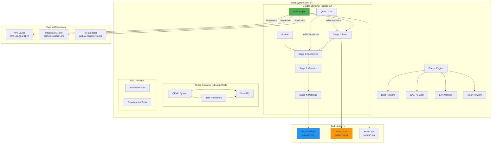
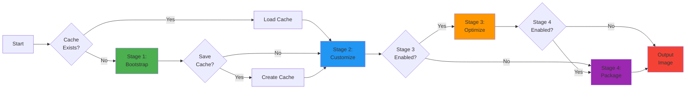
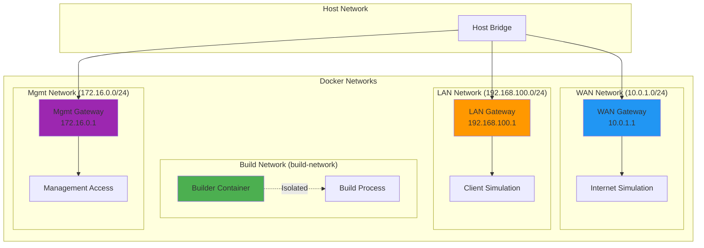
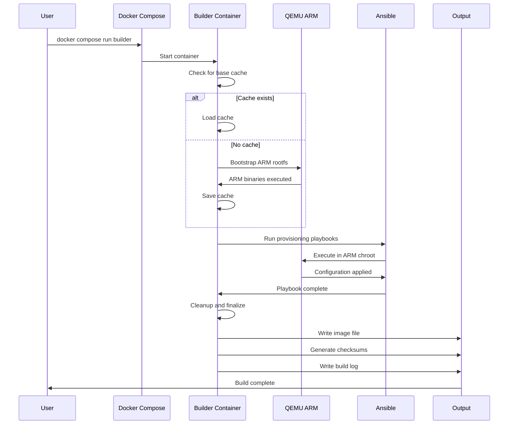
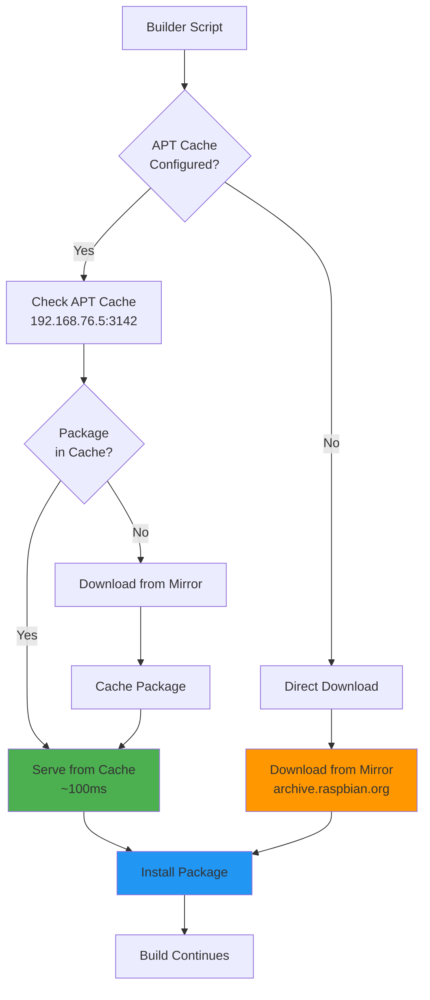
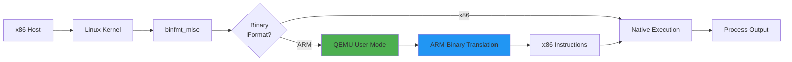
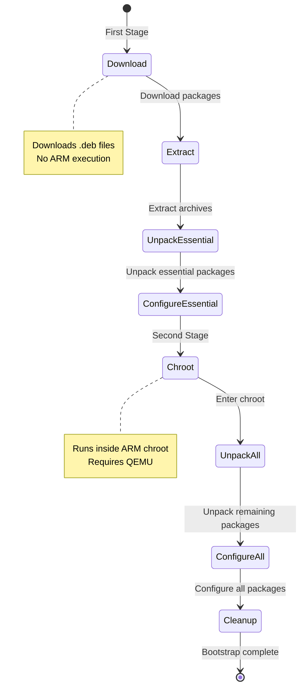
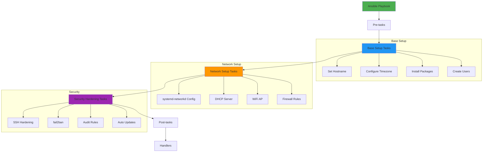
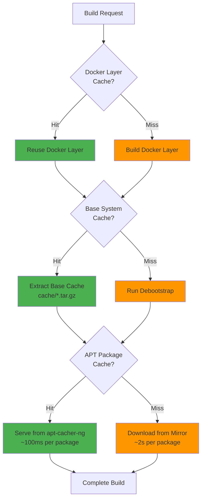
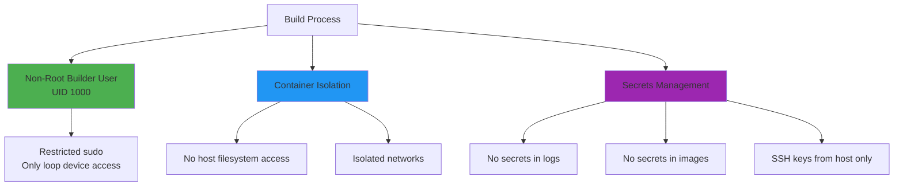

# Architecture Overview

The Pimeleon Build System is a containerized, multi-stage build pipeline that creates bootable Raspberry Pi images using ARM cross-compilation and QEMU emulation.

## High-Level Architecture



## System Components

### 1. Container Stack

The system uses three Docker containers, each with a specific purpose:

| Container | Base Image | Purpose | Key Tools |
|-----------|-----------|---------|-----------|
| **builder** | Debian 12 | Main build environment | debootstrap, QEMU, Ansible |
| **tester** | Ubuntu 22.04 | Testing and validation | QEMU System, libvirt, KVM |
| **dev** | Same as builder | Development and debugging | All builder tools + extras |

See [Containers](containers.md) for detailed specifications.

### 2. Build Pipeline

Four-stage pipeline for image creation:



See [Build Pipeline](build-pipeline.md) for detailed stage descriptions.

### 3. Network Architecture

Four isolated Docker networks for build and test isolation:



See [Network Design](networking.md) for configuration details.

## Data Flow

### Build Process Data Flow



### Package Download Flow



## Key Technologies

### ARM Emulation

Uses QEMU user-mode emulation for running ARM binaries on x86 hosts:



**How it works:**

1. Linux kernel detects ARM binary via magic bytes
2. `binfmt_misc` intercepts execution
3. Kernel invokes QEMU user-mode emulator
4. QEMU translates ARM instructions to x86
5. Process executes as if native ARM

### Debootstrap Process

Creates minimal Debian/Raspbian base system:



### Ansible Provisioning

Configuration management using Ansible in chroot mode:



## Performance Optimizations

### Multi-Layer Caching Strategy



### Cache Efficiency

| Cache Layer | Hit Rate | Time Saved | Storage |
|-------------|----------|------------|---------|
| **Docker Layer** | ~90% | 5 minutes | ~2 GB |
| **Base System** | ~85% | 10 minutes | 149 MB |
| **APT Package** | ~95% | 10 minutes | ~2 GB |
| **Combined** | - | 15-20 minutes | ~4 GB |

## Security Model

### Build-Time Security



### Runtime Security

Generated images include:

- SSH: Root login disabled, key-based auth only
- Firewall: nftables with default-deny policy
- Services: fail2ban, automatic security updates
- Audit: auditd logging for security events
- Users: Non-root 'pi' user with restricted sudo

See the troubleshooting guide for more security details.

## Resource Requirements

### Build System

| Resource | Minimum | Recommended | Notes |
|----------|---------|-------------|-------|
| **CPU** | 4 cores | 8 cores | More cores = faster builds |
| **RAM** | 8 GB | 16 GB | Docker + QEMU require memory |
| **Disk** | 50 GB | 100 GB | Includes caches and output |
| **Network** | 10 Mbps | 100 Mbps | For package downloads |

### Generated Images

| Resource | Usage | Notes |
|----------|-------|-------|
| **SD Card** | 8 GB minimum | 4 GB image, leaves room for data |
| **Pi RAM** | 1 GB (Pi 3B+) | Sufficient for routing |
| **Network** | 2-3 interfaces | eth0 (WAN), eth1 (LAN), wlan0 (AP) |

## Component Interactions

```mermaid
graph TB
    subgraph "Build Phase"
        A[docker-compose.yml] --> B[Builder Container]
        B --> C[Build Scripts]
        C --> D[Stage 1: Debootstrap]
        C --> E[Stage 2: Ansible]

        F[configs/] --> E
        G[ansible/playbooks/] --> E
    end

    subgraph "Runtime Phase (on Pi)"
        H[systemd] --> I[systemd-networkd]
        H --> J[isc-dhcp-server]
        H --> K[hostapd]
        H --> L[nftables]
        H --> M[fail2ban]
        H --> N[SSH]

        O[/etc/systemd/network/] --> I
        P[/etc/dhcp/dhcpd.conf] --> J
        Q[/etc/hostapd/hostapd.conf] --> K
        R[/etc/nftables.conf] --> L
    end

    E -.->|Generates| O
    E -.->|Generates| P
    E -.->|Generates| Q
    E -.->|Generates| R

    style B fill:#4CAF50
    style E fill:#2196F3
    style H fill:#9C27B0
```

## Next Steps

<div class="grid cards" markdown>

-   **Container Details**

    Detailed specifications of each container, Dockerfiles, and tools

    [:octicons-arrow-right-24: Containers](containers.md)

-   **Build Pipeline**

    Deep dive into each build stage and what happens

    [:octicons-arrow-right-24: Build Pipeline](build-pipeline.md)

-   **Network Design**

    Network architecture, interfaces, and routing configuration

    [:octicons-arrow-right-24: Network Design](networking.md)

</div>
