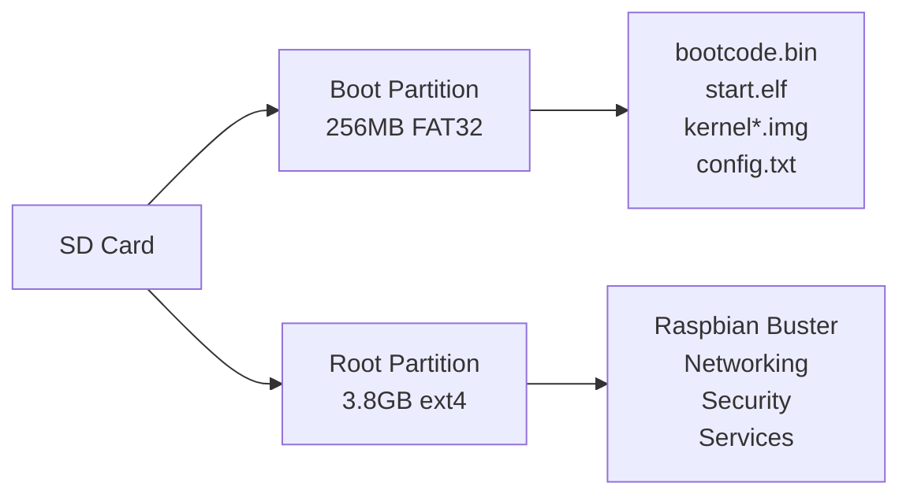

# Your First Build

This guide walks you through building your first Pimeleon image step-by-step, explaining what happens at each stage.

## Before You Start

Make sure you've completed the [Prerequisites](prerequisites.md):

- [x] Docker 24.0+ installed and running
- [x] ARM emulation support installed (`binfmt-support`, `qemu-user-static`)
- [x] 50GB+ free disk space
- [x] Repository cloned

## Step-by-Step Build Process

### 1. Clone the Repository

If you haven't already:

```bash
git clone https://github.com/yourusername/pimeleon.git
cd pimeleon
```

### 2. Review Project Structure

Take a quick look at the project layout:

```bash
tree -L 2
```

```
pimeleon/
├── docker-compose.yml          # Container orchestration
├── Makefile                    # Build automation
├── containers/                 # Dockerfiles and scripts
│   ├── builder/               # Main build container
│   └── tester/                # Test container
├── configs/                    # Configuration templates
│   ├── network/               # systemd-networkd configs
│   ├── security/              # Security configurations
│   └── services/              # Service configs
├── ansible/                    # Ansible playbooks
│   └── playbooks/             # Setup scripts
├── scripts/                    # Utility scripts
├── output/                     # Build output (created)
└── cache/                      # Build cache (created)
```

### 3. Build Docker Containers

First, build the Docker containers. This is a one-time setup (unless you modify the Dockerfiles):

```bash
export DOCKER_BUILDKIT=1
docker compose build
```

!!! info "What's happening?"
    Docker is building three containers:

    - **builder**: Debian 12 with ARM tools, debootstrap, Ansible
    - **tester**: Ubuntu 22.04 with QEMU/KVM for testing
    - **dev**: Development environment (same as builder)

    This takes 5-10 minutes on first run, using layer caching on subsequent builds.

**Expected output:**
```
[+] Building 324.5s (45/45) FINISHED
 => [builder internal] load build definition
 => [builder] installing ARM emulation support
 => [builder] installing debootstrap
 => [builder] installing Ansible
 => exporting to image
Successfully tagged pimeleon-builder:latest
```

### 4. Run Your First Build

Now create your first Pimeleon image:

=== "Quick Build (Default)"

    ```bash
    docker compose run --rm builder
    ```

    Uses default settings:

    - Pi Model: 3B+
    - Image Size: 4G
    - Raspbian: Buster (from archive)
    - No APT cache

=== "Optimized Build (Recommended)"

    If you have an APT cache server:

    ```bash
    export DOCKER_BUILDKIT=1
    export APT_CACHE_SERVER=192.168.76.5
    export RASPBIAN_MIRROR=http://archive.raspbian.org/raspbian/

    docker compose run --rm builder
    ```

=== "Custom Build"

    Customize your build:

    ```bash
    export DOCKER_BUILDKIT=1
    export PIMELEON_RPI_MODEL=3B+
    export PIMELEON_IMAGE_SIZE=8G
    export PIMELEON_INITIAL_PASSWORD=mysecurepassword
    export APT_CACHE_SERVER=192.168.76.5
    export RASPBIAN_MIRROR=http://archive.raspbian.org/raspbian/

    docker compose run --rm builder
    ```

=== "Using Makefile"

    Simplest option:

    ```bash
    make build
    ```

### 5. Watch the Build Progress

You'll see output organized by stages:

#### Stage 1: Base System Bootstrap

```
═══════════════════════════════════════════════════════════
  STAGE 1: Creating Base Raspbian System
═══════════════════════════════════════════════════════════

[INFO] Creating 4GB image file...
[INFO] Setting up partitions...
[INFO] Formatting boot partition (FAT32)...
[INFO] Formatting root partition (ext4)...
[INFO] Running debootstrap (first stage)...
[INFO] Running debootstrap (second stage)...
[INFO] Installing Raspberry Pi firmware...
[INFO] Installing kernel...
[INFO] Creating base system cache...
[SUCCESS] Stage 1 complete! (cache/pimeleon-rpi3-buster-base-v1.tar.gz)
```

!!! tip "Build Time: Stage 1"
    - **First run**: 10-15 minutes (downloading ~500MB of packages)
    - **With APT cache**: 5-8 minutes (95% cache hit rate)
    - **Subsequent runs**: 30 seconds (using base system cache)

#### Stage 2: System Customization

```
═══════════════════════════════════════════════════════════
  STAGE 2: Customizing System
═══════════════════════════════════════════════════════════

[INFO] Running Ansible playbooks...
PLAY [Pimeleon Complete Setup] ************************************

TASK [Set system hostname] *****************************************
changed: [pimeleon]

TASK [Configure timezone] ******************************************
changed: [pimeleon]

TASK [Install base packages] ***************************************
changed: [pimeleon] => (item=vim-tiny)
changed: [pimeleon] => (item=htop)
...

TASK [Configure nftables firewall] *********************************
changed: [pimeleon]

PLAY RECAP *********************************************************
pimeleon : ok=42   changed=38   unreachable=0    failed=0

[SUCCESS] Stage 2 complete!
```

!!! tip "Build Time: Stage 2"
    - 3-5 minutes (package installation and configuration)

#### Stages 3 & 4 (Currently Disabled)

```
[INFO] Skipping Stage 3 (optimization) - disabled for rapid iteration
[INFO] Skipping Stage 4 (packaging) - disabled for rapid iteration
```

!!! info "Why disabled?"
    Stages 3 and 4 are implemented but disabled in `build.sh` to speed up development. They can be enabled by uncommenting lines 55-61 in `containers/builder/scripts/build.sh`.

#### Build Complete

```
═══════════════════════════════════════════════════════════
  BUILD COMPLETE!
═══════════════════════════════════════════════════════════

Output: /output/pimeleon-20241102-103045.img
Size: 4.0GB
Build time: 12m 34s
Log: /output/build-20241102-103045.log
```

### 6. Verify Your Build

Check the output directory:

```bash
ls -lh output/
```

You should see:

```
-rw-r--r-- 1 builder builder 4.0G Nov  2 10:30 pimeleon-20241102-103045.img
-rw-r--r-- 1 builder builder  256 Nov  2 10:30 pimeleon-20241102-103045.img.sha256
-rw-r--r-- 1 builder builder 1.2M Nov  2 10:30 build-20241102-103045.log
-rw-r--r-- 1 builder builder   32 Nov  2 10:30 pi-initial-password.txt
```

#### Verify the Image

```bash
# Check file type
file output/pimeleon-*.img
# Output: DOS/MBR boot sector

# View partition table
fdisk -l output/pimeleon-*.img
```

Expected output:

```
Disk output/pimeleon-20241102-103045.img: 4 GiB
Device                                Boot  Start     End Sectors  Size Id Type
output/pimeleon-20241102-103045.img1 *      8192  532479  524288  256M  c W95 FAT32 (LBA)
output/pimeleon-20241102-103045.img2      532480 8388607 7856128  3.8G 83 Linux
```

#### Check Build Log

```bash
# View build log
less output/build-*.log

# Search for errors (should be none)
grep -i error output/build-*.log

# View summary
tail -50 output/build-*.log
```

### 7. Understand What Was Built

Your image contains:

#### Partition Layout



#### Installed Packages

| Category | Packages |
|----------|----------|
| **Base** | vim-tiny, htop, iotop, tcpdump, mtr-tiny |
| **Network** | isc-dhcp-server, hostapd, nftables, dnsmasq |
| **System** | systemd-networkd, systemd-resolved |
| **Security** | fail2ban, openssh-server, unattended-upgrades |
| **Pi Specific** | raspberrypi-kernel, libraspberrypi-bin, firmware |

#### Network Configuration

| Interface | Configuration |
|-----------|--------------|
| **bond0** (WAN) | DHCP, bonded eth0+eth1 |
| **eth1** (LAN) | Static 192.168.76.1/24 |
| **wlan0** (WiFi AP) | Static 192.168.77.1/24, SSID: pimeleon |

#### Security Features

- SSH: Key-based authentication only
- Firewall: nftables with WAN/LAN rules
- Services: fail2ban, automatic security updates
- User: 'pi' with restricted sudo access

### 8. Flash and Test

Now flash your image to an SD card:

```bash
# Find SD card device
lsblk

# Flash image (CAREFUL: this erases the SD card!)
sudo dd if=output/pimeleon-*.img of=/dev/sdX bs=4M status=progress conv=fsync

# Sync
sync
```

!!! danger "Double Check Device"
    Make absolutely sure `/dev/sdX` is your SD card and not your system drive!

### 9. First Boot

1. Insert SD card into Raspberry Pi 3B+
2. Connect ethernet cable to eth0 (WAN) - to your internet router
3. Connect to eth1 (LAN) or WiFi SSID "pimeleon"
4. Power on
5. Wait 1-2 minutes for first boot

### 10. Access Your Router

SSH into your new router:

```bash
# Via LAN
ssh pi@192.168.76.1

# Via WiFi
ssh pi@192.168.77.1
```

Use the password from `output/pi-initial-password.txt` or your SSH key.

#### Verify It Works

Once logged in:

```bash
# Check system
uname -a
# Linux pimeleon 5.10.* #1 SMP Debian * armv7l GNU/Linux

# Check network interfaces
ip addr show

# Check routing
ip route show

# Check firewall
sudo nft list ruleset

# Check services
systemctl status systemd-networkd
systemctl status isc-dhcp-server
systemctl status ssh
```

## Build Performance

Your first build metrics (typical):

| Metric | Value |
|--------|-------|
| **Container Build** | 5-10 minutes (one-time) |
| **Stage 1 (first run)** | 10-15 minutes |
| **Stage 2** | 3-5 minutes |
| **Total (first build)** | 15-20 minutes |
| **Total (with APT cache)** | 10-12 minutes |
| **Total (with base cache)** | 5-8 minutes |

## Troubleshooting First Build

### Build Fails with "No space left on device"

```bash
# Clean Docker
docker system prune -a

# Check space
df -h /var/lib/docker
```

### "exec format error" when running ARM binaries

```bash
# Reinstall ARM emulation
sudo apt install --reinstall binfmt-support qemu-user-static

# Restart Docker
sudo systemctl restart docker
```

### APT cache connection refused

```bash
# Check if cache server is running
curl http://192.168.76.5:3142

# If not working, build without cache:
unset APT_CACHE_SERVER
docker compose run --rm builder
```

### Build hangs during debootstrap

- This can happen with slow internet or DNS issues
- Press Ctrl+C and retry
- Check your internet connection
- Try a different Raspbian mirror

## Next Steps

Congratulations! You've successfully built and deployed your first Pimeleon image. 🎉

Now you can:

<div class="grid cards" markdown>

-   **Customize the build**

    Learn how to modify network config, add packages, customize services

    [:octicons-arrow-right-24: Customization Guide](../guides/customization.md)

-   **Optimize builds**

    Set up caching, enable all stages, reduce build times

    [:octicons-arrow-right-24: Performance Guide](../guides/performance.md)

-   **Understand the architecture**

    Deep dive into containers, build pipeline, networking

    [:octicons-arrow-right-24: Architecture](../architecture/overview.md)

-   **Extend functionality**

    Add custom services, integrate with other systems

    [:octicons-arrow-right-24: Configuration Reference](../reference/configuration-files.md)

</div>
