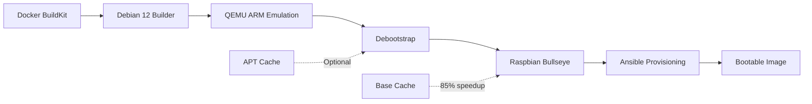

# Pimeleon Build System

<div class="grid cards" markdown>

- :material-rocket-launch:{ .lg .middle } __Quick Start__

    ---

    Get your first Pimeleon image built in minutes

    [:octicons-arrow-right-24: Getting Started](getting-started/index.md)

- :material-book-open-variant:{ .lg .middle } __User Guides__

    ---

    Learn how to build, customize, and optimize your Pimeleon images

    [:octicons-arrow-right-24: View Guides](guides/building-images.md)

- :material-cube-outline:{ .lg .middle } __Architecture__

    ---

    Understand the container-based build system and pipeline

    [:octicons-arrow-right-24: Architecture Overview](architecture/overview.md)

- :material-code-tags:{ .lg .middle } __Reference__

    ---

    Complete CLI, configuration, and API reference

    [:octicons-arrow-right-24: Reference Docs](reference/cli-commands.md)

- :material-devices:{ .lg .middle } __Multi-Platform__

    ---

    Support for multiple ARM SBCs with hardware profiles

    [:octicons-arrow-right-24: Platform Documentation](platforms/README.md)

</div>

## Overview

The __Pimeleon Build System__ is a containerized, Docker-based ARM cross-compilation
environment for creating custom Raspberry Pi router images. It automates the entire
process of building bootable SD card images with networking, security, and routing
capabilities pre-configured.

### Key Features

- :fontawesome-solid-microchip: __ARM Emulation__ - Build ARM images on x86 hardware using QEMU user-mode emulation
- :fontawesome-solid-layer-group: __Multi-Stage Pipeline__ - Automated 4-stage build
  process (base, customize, optimize, package)
- :fontawesome-brands-raspberry-pi: __Complete Pi Firmware__ - Includes bootcode.bin, start.elf, kernels for Pi 3B+
- :fontawesome-solid-gauge-high: __Smart Caching__ - Hardware-specific base system caching for 85% faster rebuilds
- :fontawesome-solid-network-wired: __Production Networking__ - systemd-networkd with bonding, DHCP, WiFi AP, firewall
- :fontawesome-solid-shield-halved: __Security Hardening__ - SSH key-only auth, fail2ban, automatic updates, audit logging
- :fontawesome-solid-bolt: __APT Cache Support__ - Optional apt-cacher-ng integration for 48% faster builds
- :fontawesome-solid-vial: __Automated Testing__ - QEMU-based integration and security testing

### What You Get

The build system produces:

- __Bootable 4GB SD card images__ ready to flash to Raspberry Pi 3B+
- __Pre-configured networking__: WAN (DHCP), LAN (static), WiFi AP
- __Routing & NAT__: Full IPv4/IPv6 forwarding with nftables firewall
- __DHCP & DNS__: ISC DHCP server and DNS resolution
- __Security__: Hardened SSH, fail2ban, automatic security updates
- __Management access__: SSH accessible via management interface

### Build Performance

| Metric | Without Cache | With APT Cache | With Base Cache |
|--------|---------------|----------------|-----------------|
| __Initial Build__ | 19:49 | 10:12 | 10:12 |
| __Rebuild__ | 19:49 | 10:12 | 5-8 min |
| __Cache Hit Rate__ | 0% | 95% | 85% |
| __Time Saved__ | - | 48.5% | 85% |

### Supported Hardware

Currently supports:

- __Raspberry Pi 3B+__ (primary target, stable)
- __Raspberry Pi 4B__ (planned)
- __Orange Pi 5 Plus__ (planned, proof-of-concept)
- __Community platforms__ (contribution framework ready)

[:octicons-arrow-right-24: View Platform Comparison](platforms/README.md)

### Technology Stack



### Quick Example

```bash title="Build a Pimeleon Image"
# Build with APT cache support
export DOCKER_BUILDKIT=1
export APT_PROXY=192.168.76.5:3142

docker compose run --rm builder
```

```bash title="Result"
✓ Stage 1: Base system created (149MB cache)
✓ Stage 2: Packages installed and configured
✓ Output: output/pimeleon-20241102-103045.img (4GB)
✓ Build time: 10:12 (with APT cache)
```

### Project Status

| Component | Status | Notes |
|-----------|--------|-------|
| Stage 1: Base System | ✅ Complete | Raspbian Bullseye bootstrap |
| Stage 2: Customization | ✅ Complete | Ansible provisioning |
| Stage 3: Optimization | 🔄 Implemented | Disabled for rapid iteration |
| Stage 4: Packaging | 🔄 Implemented | Disabled for rapid iteration |
| Testing Framework | 🔄 In Progress | Basic tests working |
| CI/CD Pipeline | ✅ Complete | GitHub Actions configured |

---

## Next Steps

<div class="grid cards" markdown>

- **New to the project?**

    Start with the [Prerequisites](getting-started/prerequisites.md) and [First Build](getting-started/first-build.md) guides

- **Ready to customize?**

    Check out the [Customization Guide](guides/customization.md) and [Configuration Reference](reference/configuration-files.md)

- **Want to contribute?**

    See the [Development Setup](contributing/development.md) and [Testing Guide](contributing/testing.md)

- **Adding a new platform?**

    Check out the [Multi-Platform Strategy](architecture/multi-platform-strategy.md) and [Platform Contribution Guide](contributing/adding-platforms.md)

</div>

## Support

- __Documentation__: [https://docs.pimeleon.org](https://docs.pimeleon.org)
- __Repository__: [GitHub](https://github.com/yourusername/pimeleon)
- __Issues__: [GitHub Issues](https://github.com/yourusername/pimeleon/issues)

---

*Built with :material-heart: using Docker, QEMU, Ansible, and MkDocs Material*
